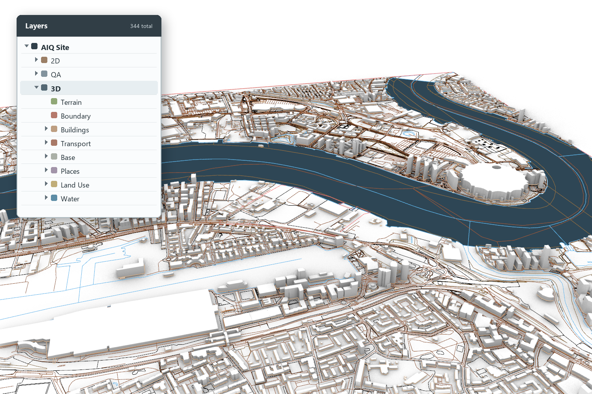
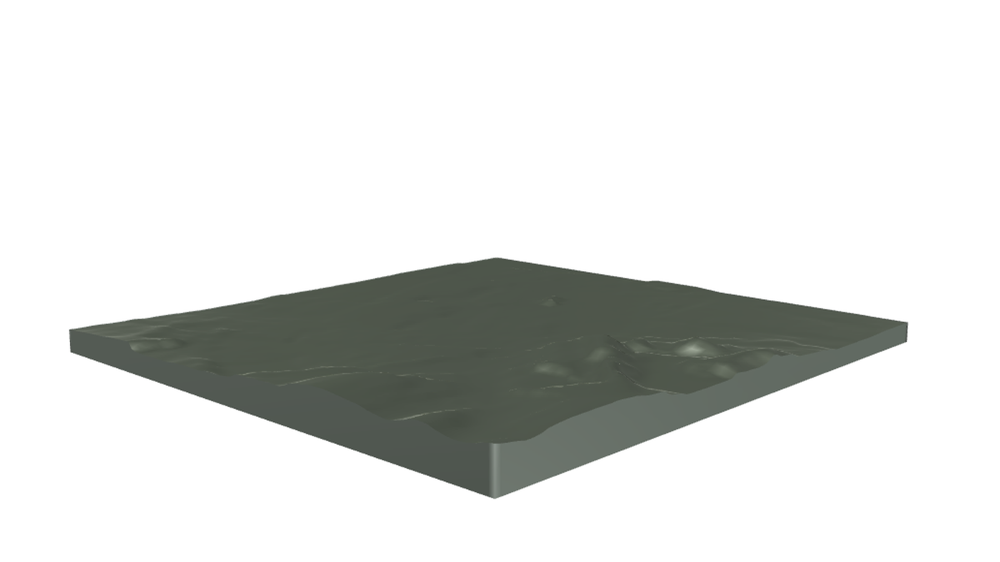
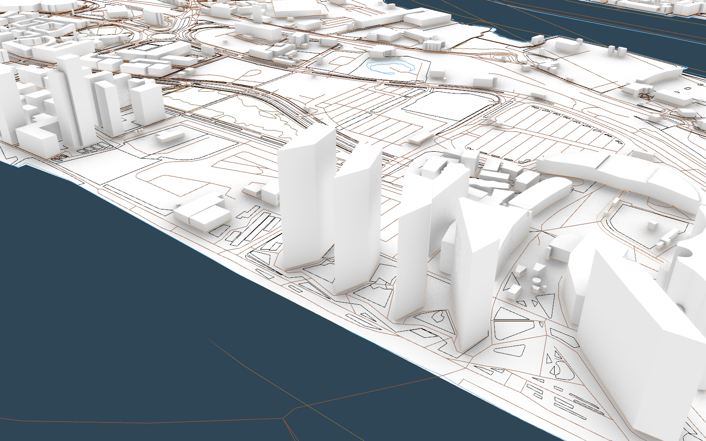
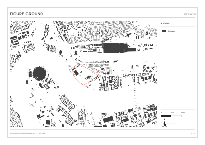

# AIQ Studio

AIQ Studio provides AI workflows for architecture, engineering, and construction. **AIQ Site Tools** has two skills: one builds a Rhino site model, and one makes vector site analysis maps from its checked 2D data.

**Installation:** See the [AIQ Site Tools installation guide](docs/distribution.md).

## Start a site project

Give the agent a site boundary or an existing Rhino model, and a project folder. For example:

> Use Rhino Site Data Model to build a 2D site model for this boundary. Add terrain and 3D buildings.

Then use the checked model for the map workflow:

> Use Vector Site Maps to make site analysis boards from this model.

## Example outputs

This example uses the Thames Wharf site in Poplar, London. The site model joins mapped buildings, streets, land, water, and terrain in one `.3dm` file. It keeps the checked 2D source layers, adds 3D building volumes, and records source data and validation results.

### Rhino site model

The `.3dm` model has 344 layers of site data. The wide view shows the model and its main layer groups. The close views show the terrain mesh in section and building detail.

| Terrain mesh in section | Building detail |
| :---: | :---: |
|  |  |

### Vector site maps

The editable SVG maps share one frame. Each map contains its base map and one theme: figure ground, green structure, or blue structure.

| Figure ground | Green structure | Blue structure |
| :---: | :---: | :---: |
|  |  |  |

The export also includes the [three-board site analysis SVG](docs/images/poplar/Site_Analysis.svg). The workflow can save a review PDF. Native Illustrator files need an application that can save and check `.ai` files.

For release work, see the [package guide](docs/packaging.md).
