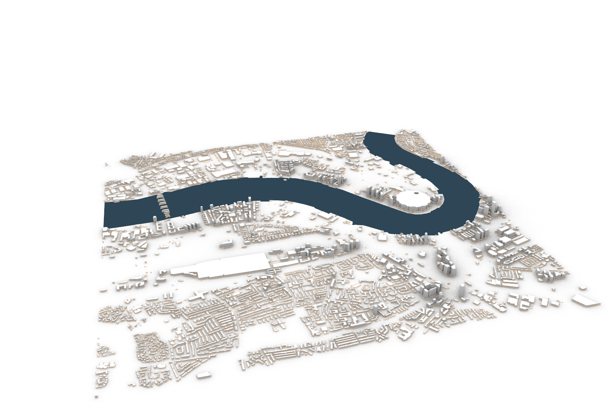
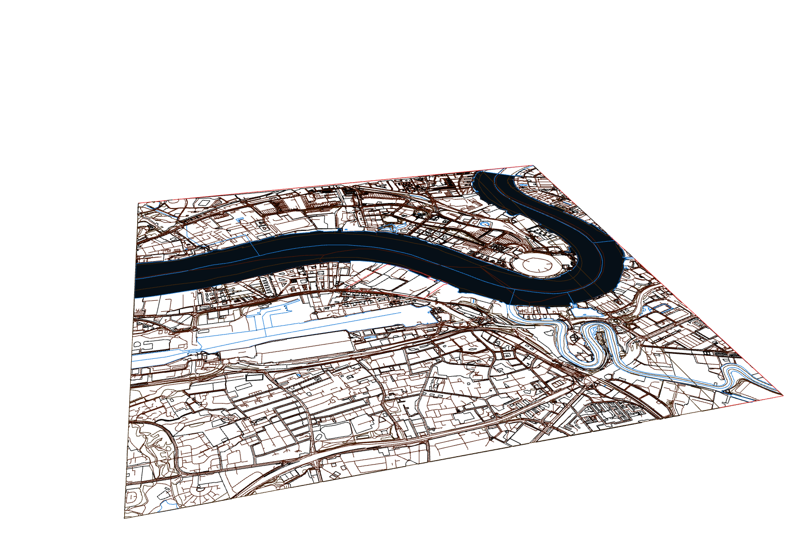

# AIQ Studio

AIQ Studio provides AI workflows for architecture, engineering, and construction. **AIQ Site Tools** has two skills: one builds a Rhino site model, and one makes vector site analysis maps from its checked 2D data.

## Install AIQ Site Tools

You need Windows and Rhino 8 to build a live Rhino model. You also need internet access to get map data. See the [installation guide](docs/distribution.md) for the Python check and full setup steps.

### Codex

1. Open this repository as a project in the Codex app.
2. Restart Codex. In the Plugins Directory, select **AIQ Studio**.
3. Install **AIQ Site Tools** and start a new chat.

### Claude Code

Run these commands, then start a new Claude Code session:

```text
claude plugin marketplace add Ashwin-Abraham/AIQ-Studio
claude plugin install aiq-site-tools@aiq-studio
```

### OpenCode

Download or clone this repository. Open PowerShell in the repository folder and run:

```powershell
.\scripts\install_opencode_skills.ps1
```

Restart OpenCode after the script finishes.

## Start a site project

Give the agent a site boundary or an existing Rhino model, and a project folder. For example:

> Use Rhino Site Data Model to build a 2D site model for this boundary. Add terrain and 3D buildings.

Then use the checked model for the map workflow:

> Use Vector Site Maps to make site analysis boards from this model.

## Workflow and example outputs

This example uses the Thames Wharf site in Poplar, London. The site model joins mapped buildings, streets, land, water, and terrain in one `.3dm` file. It keeps the checked 2D source layers, adds 3D building volumes, and records source data and validation results.

### 1. Review the Rhino site model

The images below show the same elevated Rhino view. Layer visibility and display mode change to show each part of the model.


| Building volumes and terrain | Streets, land and water with buildings hidden |
| :---: | :---: |
| [](docs/images/poplar/model-buildings.png) | [](docs/images/poplar/model-landscape.png) |

### 2. Make vector site maps

The map workflow uses one checked 2D source and one shared map frame. It makes editable SVG boards for figure ground, green structure, and blue structure. Select a map to open the full SVG.

| Figure ground | Green structure | Blue structure |
| :---: | :---: | :---: |
| [](docs/images/poplar/Figure_ground.svg) | [](docs/images/poplar/Green_structure.svg) | [](docs/images/poplar/Blue_structure.svg) |

The export also includes the [shared base map](docs/images/poplar/Base_Map.svg) and the [three-board site analysis SVG](docs/images/poplar/Site_Analysis.svg). The workflow can save a review PDF. Native Illustrator files need an application that can save and check `.ai` files.

For release work, see the [package guide](docs/packaging.md).
